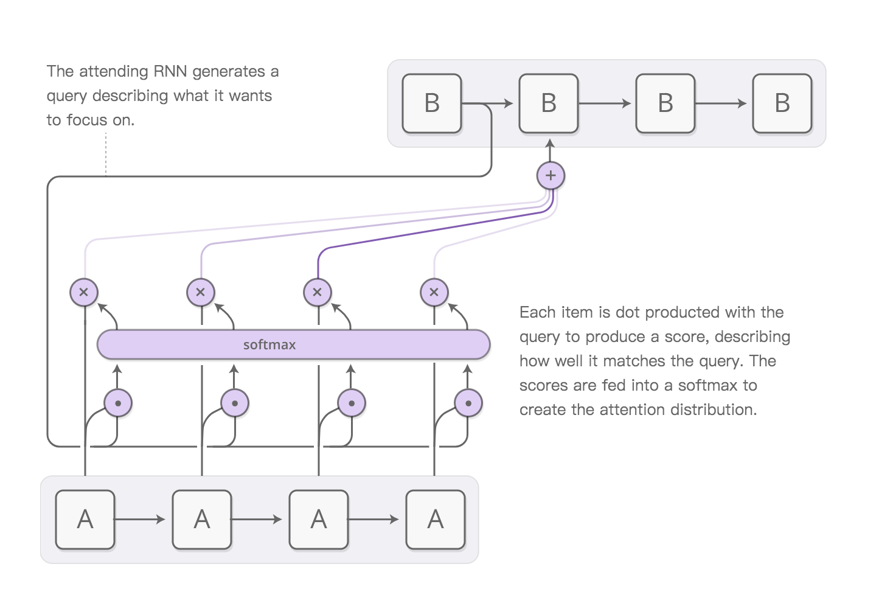

# 注意力机制 Attention

### RNN做机器翻译的经典思路 encoder-decoder

用RNN做机器翻译时，通常需要两个RNN网络，一个用来将接收待翻译语句，对其进行编码，最后输出一个vector，这个网络叫encoder。然后，该vector会作为输入，传给另一个RNN网络，该网络用来根据vector产生目标语言的翻译语句，这个网络叫做decoder。

缺点：encoder接收了不管多长的语句，最后输出的只是最后一个vector，当语句很长时，这个vector能否有效地表示该语句是很值得怀疑的。

### Attention是如何利用RNN中间的输出的？

Attention计算流程：

上图中的A是encoder，B是decoder。

A网络接收一个四个字的句子，对每个字都产生了一个输出（vector），我们称其为h1，h2，h3，h4。

B网络，第一个B产生的hidden state（s1）除了传给下一个cell外，还传到了A网络。

##### 第一步：

s1分别与h1，h2，h3，h4做点乘，产生了四个数（标量），称其为e1，e2，e3，e4。

##### 第二步：

e1，e2，e3，e4传到一个softmax层，产生概率分布a1，a2，a3，a4。

##### 第三步：

将a1，a2，a3，a4与h1，h2，h3，h4分别相乘，再相加，得到一个vector，称其为Attention vector。

##### 第四步：

Attention vector作为输入传到B网络的第二个cell中，参与预测。

以上就是Attention机制的基本思想了。我们看到，Attention vector 实际上融合了h1，h2，h3，h4的信息，具体的融合是用一个概率分布来达到的，而这个概率分布又是通过B网络上一个cell的hidden state与h1，h2，h3，h4进行点乘得到的。
Attention vector实际上达到了让B网络聚焦于A网络输出的某一部分的作用。

### Attention中产生概率分布的方法

在上一部分中，我们的概率分布来自h和s的点积再做softmax，这只是最基本的方式。实际中我们可以有不同的方法来产生这个概率分布，每一种方法都代表了一种具体的Attention机制。

##### 加法Attention

$$
e_{ij}=v_a^T\tanh(W_1h_i + W_2s_j)
$$

其中$v$和$W$都是可以训练的参数。

##### 乘法（加权点乘）Attention

$$
e_{ij}=h_i^T W s_j
$$

### 总结

首先利用RNN得到encoder中的hidden state$(h_1,h_2,...,h_T)$

假设当前decoder的hidden state是$s_{t-1}$，计算每个输入位置与当前输出位置的关联$e_{tj}=att(s_{t-1},h_j)$，算符att常见的形式有点乘，加权点乘，加法等。

对$\vec{e_t}$进行softmax得到Attention概率分布 $\vec{a_t}=softmax(\vec{e_t})$

对$\vec{a_t}$加权求和得到相应的context vector $\vec{c_t}=\sum_{j=1}^Ta_{tj}h_j$

然后计算decoder的下一个hidden state $s_t=f(s_{t-1},y_{t-1},c_t)$ 以及该位置的输出 $p(y_t|y_1,...y_{t-1},\vec x)=g(y_{t-1},s_t,c_t)$

### 参考：

[1] https://www.jianshu.com/p/c94909b835d6 （原文讲得很清楚，但公式符号前后不一致，我自己改了一下）

[2] https://zhuanlan.zhihu.com/p/47063917