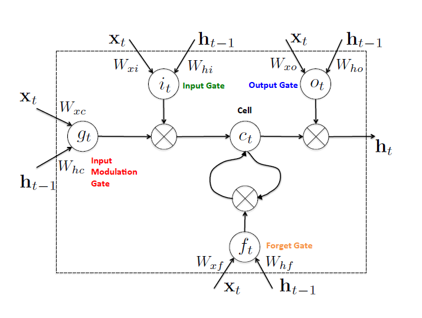

# Long short-term memory (LSTM)

LSTM可以解决普通RNN的梯度消失问题。

回忆一下普通RNN，当前时刻的输出$z_t$取决于隐藏层$h_t$，而隐藏层$h_t$取决于当前时刻的输入$x_t$和上一时刻的隐藏层$h_{t-1}$。LSTM在RNN的基础上，多了一个隐藏状态$C_t$和四个门控结构（或者说三个门，其中输入门由两部分$i_t$和$g_t$组成），如图：

四个门分别接收当前时刻的输入$x_t$和上一时刻隐藏层的状态$h_{t-1}$，然后计算隐藏状态$C_t$，最后隐藏状态$C_t$和输出门$o_t$决定当前时刻的隐藏层$h_t$，同时输出$z_t$。公式如下：
$$
i_t=\sigma(W_{xi}x_t+W_{hi}h_{t-1}+b_i) \\
f_t=\sigma(W_{xf}x_t+W_{hf}h_{t-1}+b_f) \\
o_t=\sigma(W_{xo}x_t+W_{ho}h_{t-1}+b_o) \\
g_t=\tanh(W_{xc}x_t+W_{hc}h_{t-1}+b_c) \\
c_t=f_t\circ c_{t-1}+i_t\circ g_t \\
h_t=o_t\circ\tanh(c_t) \\
z_t=softmax(W_{hz}+b_z)
$$
矩阵形式：
$$
\left [ \begin{matrix}
i_t \\ f_t \\ o_t \\ g_t
\end{matrix} \right ]
=
\left [ \begin{matrix}
\sigma \\ \sigma \\ \sigma \\ \tanh
\end{matrix} \right ]
\left( W^T
\left [ \begin{matrix}
x_t \\ h_{t-1}
\end{matrix} \right ]
+b \right)
$$

误差逆传播的推导以后再补充。

## BiLSTM

输入数据通过前向与后向的LSTM，然后拼接。

## LSTM参数数量

设输入层有1000个cell，LSTM有2000个cell，则参数数量为$(1000\times2000\times2+2000)\times4\approx16M$

## 参考资料：

[1] arXiv:1610.02583

[2] http://colah.github.io/posts/2015-08-Understanding-LSTMs/