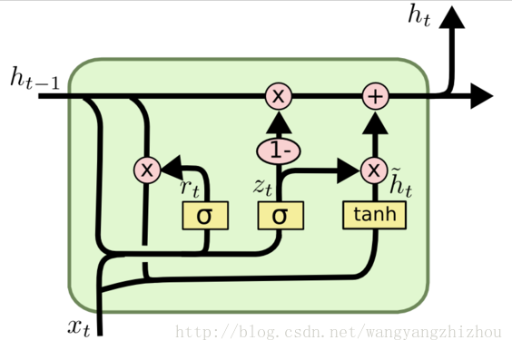

# Gated Recurrent Unit (GRU)

GRU的网络结构如图：

  

GRU是LSTM的一个变体，只有两个门：更新门 $z_t$ 和重置门 $r_t$。

公式：
$$
r_t=\sigma(W_r\cdot[h_{t-1},x_t]) \\
z_t=\sigma(W_z\cdot[h_{t-1},x_t]) \\
\tilde h_t=\tanh(W_{\tilde h}\cdot[r_t*h_{t-1},x_t]) \\
h_t=(1-z_t)*h_{t-1}+z_t*\tilde h_t \\
y_t=\sigma(w_o\cdot h_t)
$$
其中[]表示两个向量连接，*表示矩阵元素相乘。

### 理解GRU

GRU使用更少的计算量实现了和LSTM差不多的效果。

每次得到 $x_t$ 和 $h_{t-1}$ ，GRU会得到当前隐藏节点的输出 $y_t$ 和隐藏状态 $h_t$。

##### 重置：

首先用重置门来得到 “重置” 之后的数据 $\tilde h_{t-1}=r_t*h_{t-1}$ ，然后和 $x_t$ 拼接，再通过 tanh 函数激活，得到 $\tilde h_t$ 。这里 $\tilde h_t$ 包含了当前的输入数据 $x_t$ ，并有选择性地把 $\tilde h$ 添加到当前的隐藏状态。类似于 LSTM 的记忆阶段。

##### 更新：

这一步的操作就是忘记 $h_{t-1}$ 中的某些信息，并且添加当前节点输入的某些信息。

这里使用了一个门控 $z_t$ 就可以同时进行遗忘和选择记忆，遗忘了多少过去的信息 $(1-z_t)*h_{t-1}$，就使用当前对应的信息来弥补 $z_t*\tilde h_t$。

### 参考资料：

[1] https://blog.csdn.net/wangyangzhizhou/article/details/77332582

[2] 人人都能看懂的GRU - 知乎
https://zhuanlan.zhihu.com/p/32481747