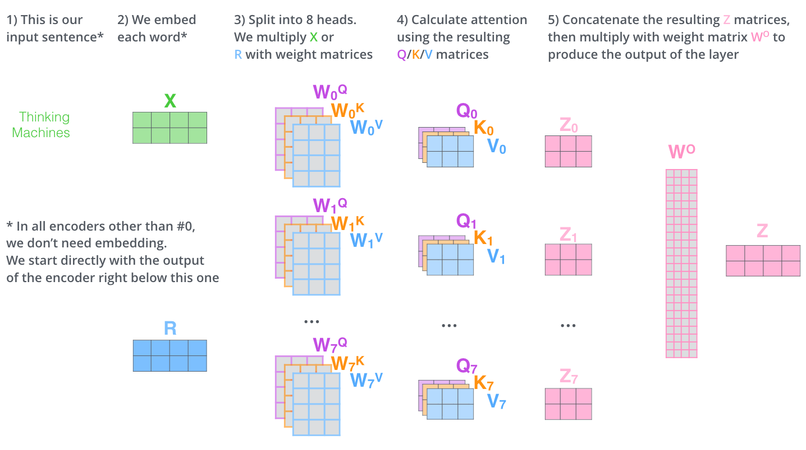

# Transformer

## 网络结构

输入 -> 6 层 encoder -> 6 层 decoder -> 输出。

## Encoder

每个 encoder 包含 Self-Attention 和 Feed Forword NN 两层。

## Positional Encoding

考虑输入序列的位置信息，实际的输入序列是 embedding 加上一个位置编码（positional encoding）。论文中使用三角函数生成位置编码。

在 decoder 的最底层也要输入相对应的位置编码。

## Self-Attention

词嵌入 Embedding 维度为 dim（下图中 dim=4），句子长度 seq，输入矩阵 X，shape(seq, dim) 。

Query, Key and Value matrices: Q, K, V, shape(seq, 64)。64为 QKV 向量的维度，下图中为3。

计算矩阵 Q: $XW_q=Q$，计算 K 和 V 方法类似。参数：Wq, Wk, Wv, shape(dim, 64)。

注意力计算：
$$
Attention(Q,K,V)=Softmax\left( \frac{QK^T}{\sqrt{64}} \right)V
$$

如图，输出 Z 即为Attention，shape(seq, 64)：

关于 Q K V 矩阵的进一步解释：

对于输入的每一个 token 都有一个 query 向量，key 向量和 value 向量。例如我们想知道 $x_1$ 位置的 attention，我们用 query 向量 $q_1$ 去乘每一个 key 向量 $k_i$，得到的值 $q_1k_i$ 相当于一个权重，再（经过归一化和 softmax）乘以对应的 value 向量 $v_i$ 并加起来就得到了 attention。

## Multi-Head Attention:

Transformer 使用了 8 个 Attention，单个 Attention 的 shape 为 (seq, 64)，8 个拼起来 shape(seq, 512)。

现在我们想把 Attention 的 shape 变为和输入 X 一致，加入一个权重矩阵 Wo，shape(512, dim)，让 Attention 矩阵和 Wo 矩阵相乘，得到 Z 矩阵，shape (seq, dim) 和 X 一致。

整个计算 Attention 的流程如图：

## Residues and Layer Normalization

Add (redisual connection)：X 为 embedding 加 positional encoding，Z 为 self-attention 层的输出。实际上进入全连接层的是经过 Layer Nornalization 的 X + Z。

Normalize：对每一层所有神经元上的数据做 normalization（不考虑 batch）。

比较：batch normalization 是对每个神经元上的一个 batch 的数据做 normalization。Batch 和 layer normalization 可以看作在两个互相垂直的维度上做归一化。

## Decoder

每一层 decoder 包含两级 Attention。

第一级 Masked Multi-head Attention 加入了 Mask 操作，即我们只能 attend 到前面已经翻译过的输出词语，后面的词语被覆盖掉了（通过设置相应的 positional encoding 为 -inf）

第二级 encoder-decoder attention，它的 Q 来自前一级 decoder 层的输出，但 K 和 V 来自 encoder，这使得 decoder 的每个位置都可以 attend 到输入序列的每一个位置。

整个流程如图：

## 参考：

[1] https://arxiv.org/abs/1706.03762

[2] https://jalammar.github.io/illustrated-transformer/

